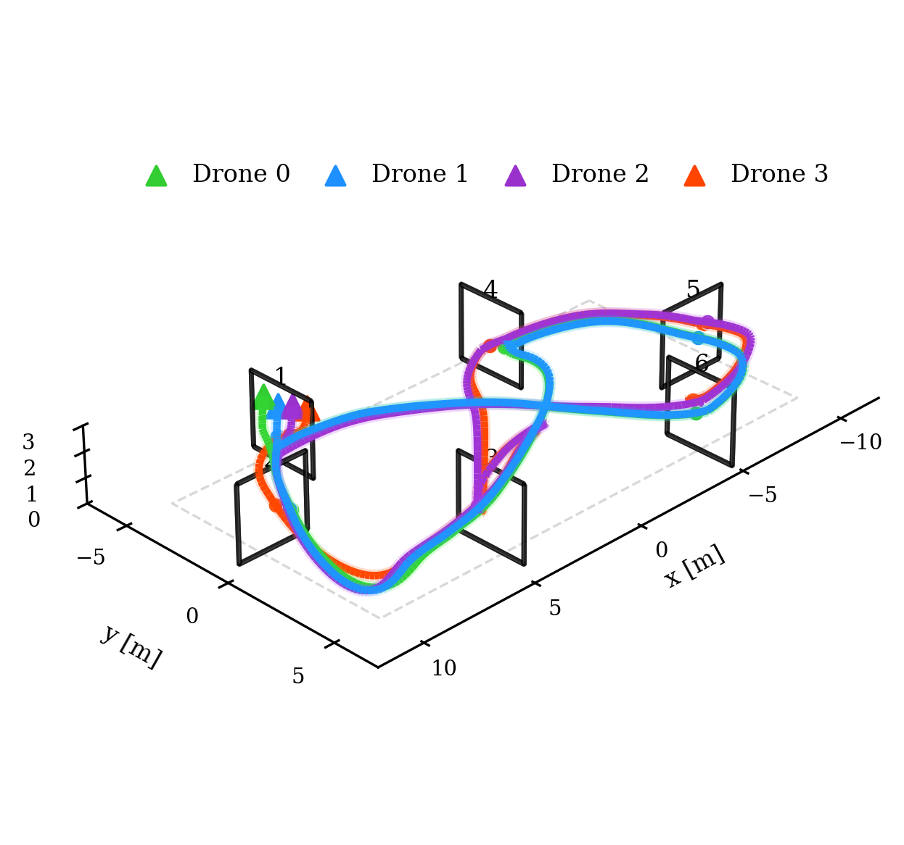

# CRUISE: Curriculum-Based Iterative Self-Play for Scalable Multi-Drone Racing

[](LICENSE)

This repository contains the official code for the paper:  
**CRUISE: Curriculum-Based Iterative Self-Play for Scalable Multi-Drone Racing**  
*Currently under review at IEEE Robotics and Automation Letters (RA-L)*.

---

## Table of Contents

- [Overview](#overview)
- [Installation](#installation)
- [Usage](#usage)
- [Pretrained Models](#pretrained-models)
- [Citation](#citation)
- [License](#license)

---

## Overview

This repository implements CRUISE, a curriculum-based iterative self-play algorithm designed for scalable multi-drone racing.  
We provide training and testing scripts, as well as pretrained models used in the paper.

---

## Figure: Multi-Drone Trajectory

Below is an example of four drone trajectories on a track (see: `figs/FigEight_track.png`):




---

## Installation

**Requirements:**
- [Miniconda/Anaconda](https://docs.conda.io/en/latest/miniconda.html)
- Python 3.12

**Step 1:** Create and activate a Python 3.12 conda environment:
```sh
conda create -n cruise python=3.12
conda activate cruise
```


**Step 2:** Install required Python libraries:
```sh
pip install -r requirements.txt
```

Your environment is now ready for use.


## Usage
### Training
To train the curriculum-based algorithm from scratch, run:
```sh
python curriculum_train.py
```


### Testing
To test a trained model and reproduce results from the paper, run:
```sh
python test.py
```


## Pretrained Models
Pretrained models corresponding to the results presented in our paper are provided in this repository.
You can directly use them for evaluation and benchmarking with the test.py script above.


# Citation

This paper is currently under review IEEE Robotics and Automation Letters


# License
This repository is released under the MIT License.